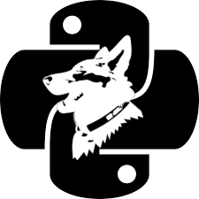

# Python Log Shepherd

A simple Python logs shipper.

## Note

This project is still under construction.

## What is PLS?

This develop is motivated by the need of have a log shipper for AIX.

I know there are a few log shippers out there: fluentd, logstash, filebeat, rsyslog, syslog-ng...

But each of them have issues to run on AIX. From the inexistence of a Go compiler to the use of certain Java features that are in Oracle JVM but not in IBM's one.

So, having those applications as model I started this Python app.

## Architecture

The shepherd it is being built as a main script that handles the loop and plugins as inputs, filters (not completed) and outpus. (It is no my invention, all the mentioned applications have it)

The main loop is quite simple:

  1. Instantiate the input plugin
  2. Instantiate the filter plugin
  3. Instantiate the output plugin
  4. Call the input
  5. If there is no errror call the filter
  6. If there is no errror call the output
  7. If there is no errror call the input ack
  8. Sleep n seconds
  9. Repeat the loop from point 4
  
## Usage

So far, the **PLS** comes with a file input plugin and a stdout and kafka outputs.

To put it to work just follow these steps:

  - Clone the code 
  - Rename the files in *config* dir from *.conf.sample to *.conf
  - In *python-log-shepherd.conf* replace values of plugins and interval if needed
  - In *input_file.conf* replace the *Input.Paths* (paths to files to watch with no wildcards) and *Registry.Path* (here are stored the file offsets).
  - Run *python-log-shepherd.py*
  
Now you will see a lot of debug info and, when data is added to the files, the output generated by **PLS**.

## How to add a plugin?

Rules to add a plugin:

  - Plugins are stored in plugins dir
  - File name must be prefixed with *input_*, *output_* or *filter_*, then the name. (e.g. *input_file.py* where *file* is the plugin's name)
  - In the *python-log-shepherd.conf* Reader refers to inputs, Filters to filters and Writer to outputs.
  - In the *python-log-shepherd.conf* plugin must be set by its name. (e.g. *Reader=file* refers to input_file.py)
  - Each plugin must set a class that must be named as follows:
    - For inputs: *pluginname_reader*
    - For outputs: *pluginname_writer*
    - For filters: *pluginname_filter*

### Inputs

### Outputs

### Filters

## Note on ConfigParser

I included the ConfigParser code into this code due to the inexistence of this package as a standard in AIX's Python. 

If you want to use the package or you have installed it as default, chage this line:

	import vendors.ConfigParser as ConfigParser

to this one:

	import ConfigParser